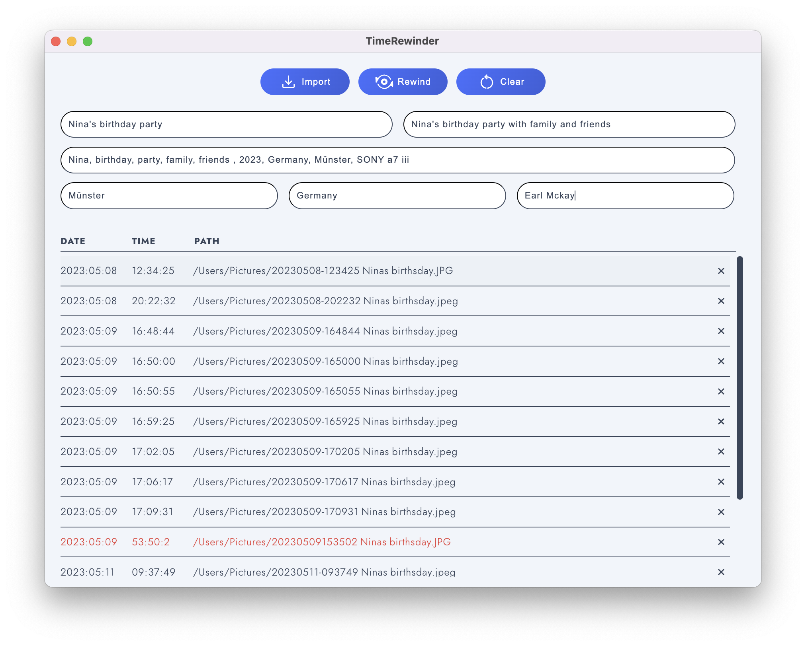

# TimeRewinder
Unfortunately, it happens that the creation date is overwritten during editing or conversion or that some photo programmes (e.g. Synology Photo) sort the videos according to the modification date. Time Rewinder helps to reset the timestamps (creation and modification date) to the origin based on the file name.

------------
## Required tools
 - Last Version of [TimeRewinder](https://github.com/earlmckay/timestamp-rewinder/releases)
 - The programme assumes a fixed file naming: `YYYYMMDD-HHMMSS ...`

------------

## Recommended workflow
1. First rename all pictures and videos (before editing!) according to the pattern `YYYYMMDD-HHMMSS ...`. For batch renaming you can use [Adobe Bridge](https://www.adobe.com/en/products/bridge.html), [Advanced Renamer](https://www.advancedrenamer.com) for Windows or 
[NameChanger](https://mrrsoftware.com/namechanger/) on Mac. 
This way `DMC2047375.jpg` becomes `20230513-141827 - Ninas birthsday.jpg`
2. Now the images can be developed and the videos edited and converted.
3. When the editing is finished and the files are ready for archiving, TimeRewinder comes into action.
4. A folder can now be selected using the Import button. All the media (pictures, videos and audio) in that folder will be listed in the table. You can now check that the data was read correctly. You can remove a file from the list by clicking 'X' if you do not want it to be processed. 
5. Press the button "Rewind" to start changing the data.

# Tips
On external drives, the modification date will not be corrected. In this case, you can save the data locally and correct it.

## For development
 - [Node.js](https://nodejs.org/en)

|         |                   |
| ------- | ----------------- |
| Install | · `npm install`   |
| Develop | · `npm start`   |
| Build Mac  | · `electon-builder -m` |
| Build  Win | · `npx electron-builder` |

In order to eliminate vulnerabilities caused by electron itself, please run `npm update` and `npm audit fix`. This will apply overrides.